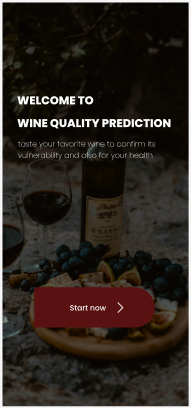
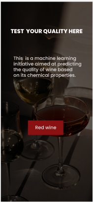
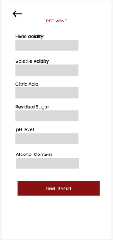
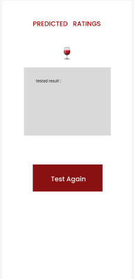

## Overview

This project is a **Wine Quality Prediction API** built using **FastAPI**. It allows users to predict the quality of wine based on its chemical properties such as fixed acidity, volatile acidity, citric acid, residual sugar, pH level, and alcohol content. The API utilizes a machine learning model (RandomForestRegressor) trained on a wine quality dataset.

The project demonstrates a scalable backend setup using FastAPI, featuring endpoints for submitting wine features and receiving quality predictions in real-time.

---

## Features

- **Wine Quality Prediction**: Predicts the quality of wine based on six key chemical properties.
- **Real-time Inference**: Uses a pre-trained RandomForest model for rapid predictions.
- **RESTful API**: Built with FastAPI for high performance and easy scalability.
- **Automated Documentation**: Swagger UI and ReDoc support for easy API testing.

---

## Screenshots

### 1. welcome.dart


### 2. second.dart


### 3. input.dart


### 4. prediction.dart


---

## Installation

To get the Wine Quality Prediction API running locally, follow these steps:

### Prerequisites

- **Python 3.8+** installed
- **pip** for package management

### Steps

1. **Clone the repository**:
   ```bash
   https://github.com/sergekamanzi/ML-sum-tive.git
   cd ML-sum-tive
   ```

2. **Install dependencies**:
   ```bash
   pip install -r requirements.txt
   ```

3. **Train the model and save it (if needed)**:
   Ensure you have the `best_model.pkl` and `scaler.joblib` files in your project directory. If not, refer to the model training instructions in the project folder.

4. **Run the FastAPI server**:
   ```bash
   uvicorn app:app --reload
   ```

6. **Access the API**:
   - Swagger UI: [http://127.0.0.1:8000/docs](http://127.0.0.1:8000/docs)
   - ReDoc: [http://127.0.0.1:8000/redoc](http://127.0.0.1:8000/redoc)

---

## Usage

### 1. API Root
Visit the root endpoint to confirm the server is running:
```bash
GET http://127.0.0.1:8000/
```
_Response_:
```json
{
  "message": "Welcome to the Wine Quality Prediction API"
}
```

### 2. Predict Wine Quality

Send a POST request with wine features to the `/predict/` endpoint to predict wine quality.

**Example Request**:
```bash
POST http://127.0.0.1:8000/predict/
```

**Request Body**:
```json
{
    "fixed_acidity": 7.4,
    "volatile_acidity": 0.7,
    "citric_acid": 0.0,
    "residual_sugar": 1.9,
    "ph": 3.51,
    "alcohol": 9.4
}
```

**Response**:
```json
{
    "Predicted Wine Quality": 5.3
}
```

---

## Model Information

The API uses a **RandomForestRegressor** model that was trained on a dataset of red wine qualities. The dataset contains several chemical features of wine samples and their corresponding quality ratings on a scale of 0 to 10.

- **Model**: RandomForestRegressor
- **Input Features**: fixed acidity, volatile acidity, citric acid, residual sugar, pH level, alcohol content.
- **Prediction**: Wine quality (0-10)

---

## Contributing

We welcome contributions to improve the API! If you'd like to contribute:
1. Fork the repository.
2. Create a new branch (`git checkout -b feature-branch`).
3. Make your changes.
4. Push to the branch (`git push origin feature-branch`).
5. Open a pull request.

---

## License

This project is licensed under the **MIT License**.

---

### Author

**Kamanzi Serge**  
Email: s.kamanzi@alustudent.com 
GitHub: [github.com/sergekamanzi](https://github.com/sergekamanzi)

---
